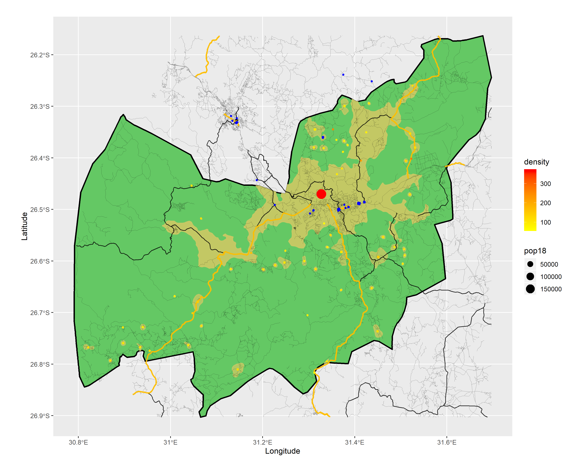

# Final Project: North Korea, and Manzini, Swaziland

by: Shane Evanson

###### Something to note:
Before Project 3 I chose North Korea because it's an interesting backwards state I wanted to learn a little more about, but because it lacks data that I needed for the third project, I had to end up switching to Swaziland. As a result of this, I don't have the content from Project 1 and 2 for Swaziland, or the content for Project 3 and 4 for North Korea, and which LMIC that I am talking about switches halfway through. 

## The Beginning: North Korea

### A 2D view of roads and healthcare facilities:

### A 3D topographical view of the province:

