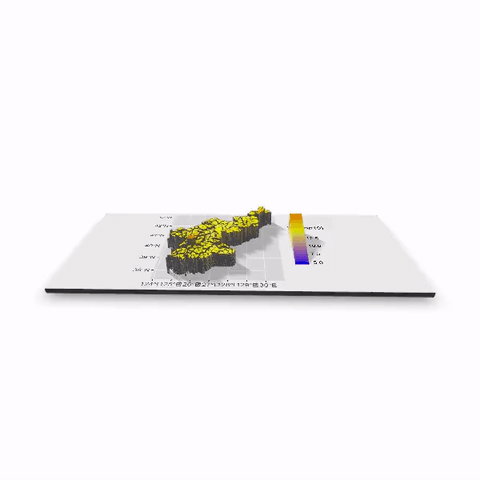
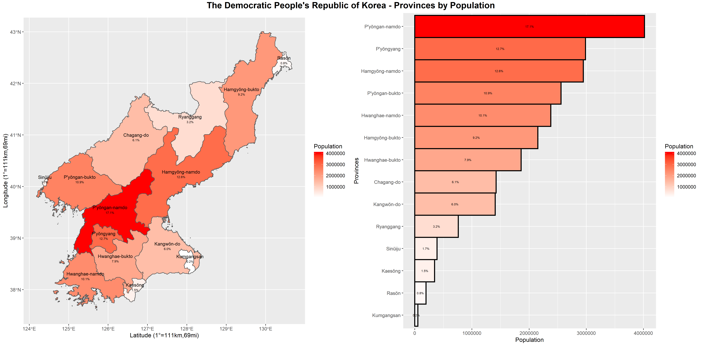
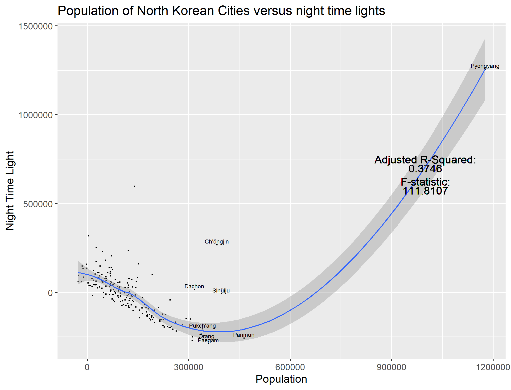
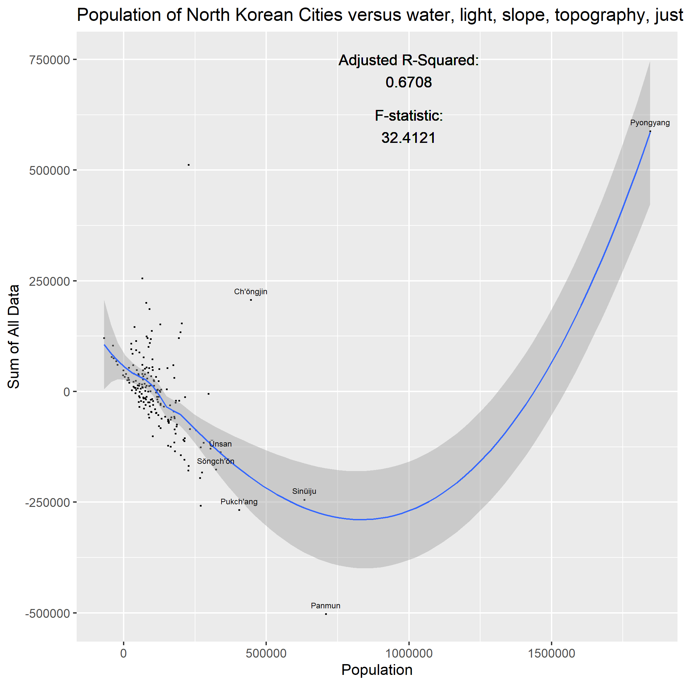
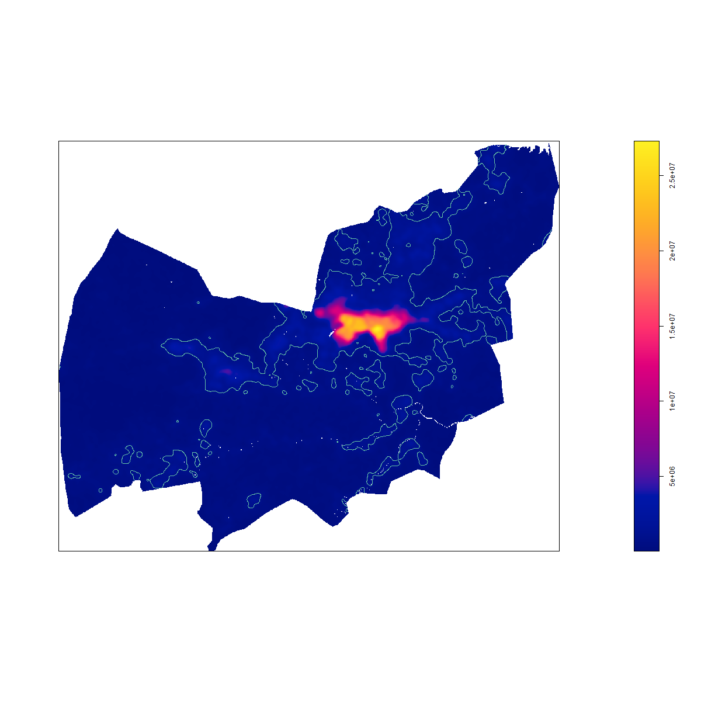
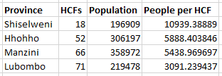

# Final Project: North Korea, and Manzini, Swaziland

by: Shane Evanson

###### Something to note, regarding LMIC change:
 Prior to Project 3, I chose North Korea because it's an interesting backwards state that I wanted to learn more about. However, it lacks data that I needed for the third project, so I had to end up switching to Swaziland. As a result, I don't have the content from Project 1 and 2 for Swaziland, or the content for Project 3 and 4 for North Korea, and which LMIC that I am discussing switches back and forth, depending on whether I have charts to support my claims or not for that country. 

### Swaziland: Administrative Borders and Subdivisons

Swaziland has 4 provinces and 55 cities within its borders. As can be seen in the 3d topographical plot (with overlayed roadways), the borderlines of the country roughly follow the mountain ridges that line the province of Manzini. The same applies elsewhere in Swaziland, and to its international borders.

### North Korea: Population 

As shown in the animation, only one subdivision of North Korea really has a significant population, which is Pyongyang city. The distribution of population all centers around Pyongyang-namdo province, decreasing as one goes further from it. This makes a lot of sense, since Pyongyang is the capitol of North Korea where the government is centered, Kim Jong Un resides, and all of the resources are.

When comparing the population of North Korea against other geospatial covariates, it does not appear to depend on any individual covariate. Topography, water, and even the most suitable covariate, nighttime lighting, did not show a high R-squared value. A indicated on the residual graph of population versus nighttime lights, the r-squared value was only 0.37, meaning that only about 37% of all NTL data successfully could predict the population for a given gridcell. This improved significantly after comparing the population to the sum of all the covariates, coming up to an R^2 of .67, and this was the best geospatial-covariate-based prediction of population that was made.

### Swaziland: Settlements, Roads, and Healthcare Facilities

There are numerous small settlements dotting Manzini province, which roughly trail alongside the primary roadways. They are not very dense, only containing a few 100 persons each. In the north there is a fairly dense, and very populous city, Manzini, which as indicated on the above density heatmap, is far denser than any of the rest of the province. The settlements appear to have spread primarily on the flattest available terrain, which the city rests upon (Flatness can be seen there on the 3D heightmap at the top of the page). 

In the above plot, urbanized areas of Swaziland are stretched further past the city itself to illustrate that there are more decently sized settlements outside of the city itself, and that they follow the roadways. The primary roads take the paths of least resistance around Swaziland, avoiding climbing mountains and instead going around the mountainous terrain through the valleys between them.

